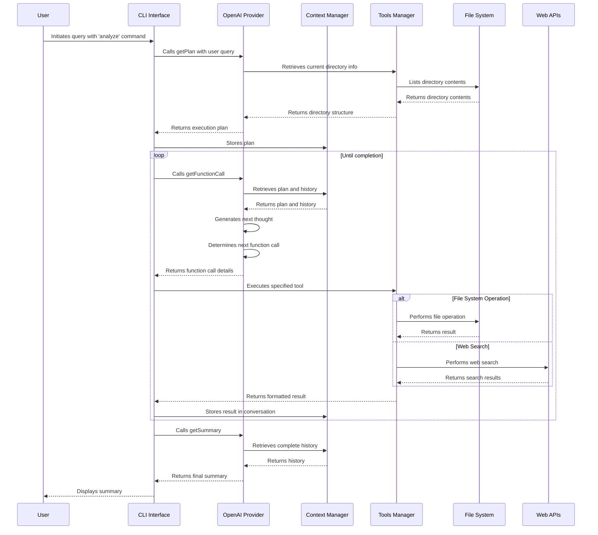

# Autonomous Code Analyzer: AI-Powered Codebase Intelligence

## Overview

The Autonomous Code Analyzer is an AI-powered CLI tool that uses OpenAI's GPT models to analyze codebases, search for specific patterns, and perform operations on files. The system follows an agent-based architecture where the AI creates a plan, executes a series of tools according to that plan, and then summarizes the findings.

## Features

- **Natural Language Understanding**: Ask questions about your codebase in plain English
- **Intelligent Codebase Analysis**: Get insights about your code structure, patterns, and organization
- **Web Research Integration**: Search the web directly from your terminal with DuckDuckGo Lite
  - Customizable search parameters including domain-specific queries
  - Structured results with titles, URLs, and descriptions
- **File Operations**: Find files, read content, and create new files - all through conversational commands
- **Pattern Search**: Use grep-like functionality through simple queries
- **Execution Planning**: Advanced AI planning capabilities to break down complex requests into manageable steps
- **Extensible Architecture**: Easy to add new tools and AI providers to enhance functionality
- **Markdown-Formatted Results**: Clean and readable output for improved developer experience

## Installation

1. Clone this repository:
   ```bash
   git clone https://github.com/yourusername/autonomous-code-analyzer.git
   cd autonomous-code-analyzer
   ```

2. Install dependencies:
   ```bash
   npm install
   ```

3. Create a `.env` file in the project root and add your OpenAI API key:
   ```
   OPENAI_API_KEY=your_openai_api_key_here
   ```

4. Make the script executable:
   ```bash
   chmod +x src/index.js
   ```

## Usage

```bash
# Basic usage - ask a question about your codebase
node src/index.js analyze -q "explain codebase"

# Specify AI provider (default: openai)
node src/index.js analyze --query "What files are in src folder?" --provider openai

# Read file contents
node src/index.js analyze --query "read this file package.json"

# Perform web searches and generate structured output
node src/index.js analyze --query "do a web search for top 5 social medias and create a json with that info"

# Perform domain-specific web search
node src/index.js analyze --query "search for nodejs best practices on github.com"

# Find specific patterns in your code
node src/index.js analyze --query "find all files that import axios"

# Get insights about your codebase architecture
node src/index.js analyze --query "explain the directory structure and key components"

# Create documentation based on your code
node src/index.js analyze --query "generate documentation for the tools directory"

# Update an existing file with new content
node src/index.js analyze --query "update package.json to add axios dependency"
```

## Options
- `-q, --query <query>`: Question or instruction about your codebase (required)
- `-p, --provider <provider>`: AI provider to use (default: openai)
- `-h, --help`: Display help information
- `-V, --version`: Display version information


## System Components

### Core Components

1. **Entry Point (index.js)**
   - Initializes the CLI command structure
   - Orchestrates the overall execution flow
   - Manages the loop of function calls until completion

2. **AI Provider (OpenAI)**
   - Handles communication with OpenAI APIs
   - Implements three key functions:
     - `getPlan`: Generates an execution plan
     - `getFunctionCall`: Determines the next tool to execute
     - `getSummary`: Summarizes findings after execution

3. **Context Management (context.js)**
   - Maintains state throughout execution
   - Stores conversation history, current directory, and plan
   - Provides utility functions for state management

4. **Tools Management (tools.js)**
   - Registers available tools with their schemas and execution functions
   - Validates tool arguments against schemas
   - Handles tool execution and formatting of results

### Available Tools

1. **list_directories**: Lists files and directories in a specified path
2. **read_file_content**: Reads the content of a file
3. **grep_search**: Searches for patterns in files
4. **find_files**: Finds files matching specific patterns
5. **create_file**: Creates a new file with specified content
6. **update_file**: Updates the content of an existing file
7. **web_search**: Performs web searches using DuckDuckGo Lite

## Execution Flow Sequence



## Prompt Structure and Tool Sequence

### 1. Plan Generation

The system starts with the `getPlan` function, which uses the following prompt structure:

- **System Prompt**: Instructs the AI to create an execution plan based on:
  - Operating system info
  - Node.js version
  - Current working directory and its contents
  - Available tools and their descriptions
- **User Message**: Contains the user's query

The response is a structured plan with a goal statement and numbered steps.

### 2. Function Call Generation

The `getFunctionCall` function uses a two-stage process:

1. **First Stage (Next Thought)**:
   - System prompt contains context about directory, available tools, and instructions to follow the plan
   - Previous messages are included for context
   - Generates a "next thought" explaining what action will be taken

2. **Second Stage (Tool Selection)**:
   - Uses the next thought as guidance
   - Selects the appropriate tool and arguments
   - Returns a structured function call object

### 3. Tool Execution

Tools are executed based on their registered functions in the tools.js file:

1. Each tool has a schema for argument validation
2. The execution function is called with the provided arguments
3. Results are formatted according to each tool's formatting function
4. Results are added to the conversation history

### 4. Summary Generation

After all steps are completed, the `getSummary` function:

- Reviews the entire conversation history
- Compares actual execution against the original plan
- Generates a concise summary of findings
- Adds the summary to the conversation history

## Special Focus: Web Search Implementation

The web search tool (`web_search`) stands out as a particularly useful feature:

- Uses DuckDuckGo Lite to avoid rate limiting issues
- Parses HTML responses with Cheerio to extract structured results
- Returns search results with titles, URLs, descriptions, and display URLs
- Can be customized with a maximum number of results parameter

## System Design Principles

1. **Modular Architecture**: Each component has a single responsibility
2. **Stateful Context**: Maintains state throughout execution
3. **Tool Abstraction**: Tools are registered with a common interface
4. **Validation**: Arguments are validated against schemas
5. **Conversation Management**: All interactions are tracked as a conversation

## Conclusion

The Autonomous Code Analyzer demonstrates an effective architecture for AI-powered CLI tools. By separating planning, execution, and summarization into distinct phases, it provides a structured approach to solving complex code analysis tasks. The use of tool abstractions allows for easy extension with new capabilities while maintaining a consistent interface for the AI to interact with.

## Example Output

```bash
node src/index.js analyze -q "explain codebase"
Generating plan...

 Goal: The user wants me to provide an overview of the codebase in the current working directory, which includes the purpose of the files and their relationships. I will achieve this by examining the README.md file for documentation, checking the structure in the src directory for any key components, and providing a summary of the project's functionality based on the gathered information. 


 ** I'll start by checking the structure of the current directory to locate the README.md file and the src directory. This will allow me to assess the available documentation and key components of the codebase.

-- Tool: list_directories
--Arguments: {"path":"/Users/looper/workshop/ai-agent-terminal/autonomous-code-analyzer","options":"al"}

-- Matches: 11

 ** I've found the README.md file and the src directory. I'll first read the contents of the README.md file to gather information about the project's purpose and any relevant documentation.

-- Tool: read_file_content
--Arguments: {"path":"/Users/looper/workshop/ai-agent-terminal/autonomous-code-analyzer/README.md"}


 ** I have reviewed the README.md file, which outlines that the project is an AI-powered command-line tool for code analysis, utilizing OpenAI's GPT models. It offers features like natural language understanding, intelligent analysis, web search integration, and file operations. 

Next, I'll check the structure of the `

-- Tool: list_directories
--Arguments: {"path":"/Users/looper/workshop/ai-agent-terminal/autonomous-code-analyzer/src","options":"a"}

-- Matches: 4

 ** The `src` directory contains the following key components: `index.js` (the main entry point), and three subdirectories: `providers`, `tools`, and `utils`. I will summarize the purpose of these components based on typical usage in similar projects.

-- Tool: find_files
--Arguments: {"pattern":"*.js","dirPath":"/Users/looper/workshop/ai-agent-terminal/autonomous-code-analyzer/src","type":"f"}

-- Matches: 17

 ** The `src` directory includes several key files and subdirectories. 

- **Main Entry Point:**
  - `index.js`: Initializes the CLI and orchestrates execution flow.

- **Providers (subdirectory):**
  - Contains files related to different AI providers, specifically OpenAI:
    -

-- Tool: read_file_content
--Arguments: {"path":"/Users/looper/workshop/ai-agent-terminal/autonomous-code-analyzer/src/index.js"}


 ** The `index.js` file sets up the command-line interface (CLI) for the AI-powered tool. It initializes the CLI, allowing the user to execute an `analyze` command to query the codebase using an AI provider. The main functions within this file include generating a plan based on user

-- Tool: read_file_content
--Arguments: {"path":"/Users/looper/workshop/ai-agent-terminal/autonomous-code-analyzer/src/providers/index.js"}


 ** The `src/providers/index.js` file acts as an index for the available AI providers, currently exporting the OpenAI provider. It allows for easy extension by enabling the addition of other providers in the future. 

Next, I'll read the content of the files in the `src/tools` directory to understand

-- Tool: find_files
--Arguments: {"pattern":"*.js","dirPath":"src/tools","type":"f"}

-- Matches: 7

 ** I will now read the contents of the files in the `src/tools` directory to understand their functionalities and how they contribute to the overall project. I'll start with `createFile.js`.

-- Tool: read_file_content
--Arguments: {"path":"/Users/looper/workshop/ai-agent-terminal/autonomous-code-analyzer/src/tools/createFile.js"}


 ** The `src/tools/createFile.js` file defines a function that creates a new file at a specified path with given content. It checks if the file already exists and creates the necessary directory structure if it doesn't. The file also exports a JSON schema that describes the parameters required for creating a file.

Next

-- Tool: read_file_content
--Arguments: {"path":"/Users/looper/workshop/ai-agent-terminal/autonomous-code-analyzer/src/tools/findFiles.js"}


 ** The `src/tools/findFiles.js` file provides functionality to search for files matching a specified pattern within a given directory. It includes:

- A schema definition for the parameters used in the file search.
- Functions for converting glob patterns to regular expressions, checking file types, parsing options, and recursively travers

-- Tool: read_file_content
--Arguments: {"path":"/Users/looper/workshop/ai-agent-terminal/autonomous-code-analyzer/src/tools/listDirectories.js"}


 ** The `src/tools/listDirectories.js` file includes a function that lists the contents of a specified directory. This file features:

- A JSON schema to define the structure for its input parameters.
- The `listDirectories` function, which reads directory contents using Node.js's native `fs` module.

-- Tool: read_file_content
--Arguments: {"path":"/Users/looper/workshop/ai-agent-terminal/autonomous-code-analyzer/src/tools/readFile.js"}


 ** The `src/tools/readFile.js` file provides the functionality to read a file's contents at a specified path. It includes:

- A JSON schema defining the expected input parameters for the file reading function.
- The `readFile` function, which reads the file using the specified encoding (defaulting

-- Tool: read_file_content
--Arguments: {"path":"/Users/looper/workshop/ai-agent-terminal/autonomous-code-analyzer/src/tools/searchGrep.js"}


 ** The `src/tools/searchGrep.js` file provides functionality for searching text patterns within files using a method that mimics the `grep` command in Unix-like systems. It includes:

- A `grepSearchSchema` defining the parameters required for the search function.
- The `grepSearch` function

-- Tool: read_file_content
--Arguments: {"path":"/Users/looper/workshop/ai-agent-terminal/autonomous-code-analyzer/src/tools/updateFile.js"}


 Generating summary... 

The `src/tools/updateFile.js` file defines functionality to update the content of an existing file. Key components include:

- A JSON schema (`updateFileSchema`) that specifies the required structure of input parameters, which includes the file path and new content.
- The `updateFile` function, which checks for the file's existence, writes the new content, and returns updated file stats.

### Summary of Findings

Based on the exploration of the project, here's a concise overview of the **Autonomous Code Analyzer**:

- **Purpose:** An AI-powered Command-Line Interface (CLI) tool for analyzing codebases, utilizing OpenAI's models for improved interaction and code insights.
  
- **Key Components:**
  - **Main Entry Point (`src/index.js`)**: Sets up the CLI and handles user commands to analyze the codebase.
  - **Providers (`src/providers`)**: Currently includes OpenAI, which handles execution plans and communication with the AI functionality.
  - **Tools Subdirectory (`src/tools`):**
    - `createFile.js`: Manages file creation with validations.
    - `findFiles.js`: Searches for files based on specified patterns within directories.
    - `listDirectories.js`: Lists directory contents with various display options.
    - `readFile.js`: Reads file contents based on the path and encoding.
    - `searchGrep.js`: Performs text searches in files similar to Unix `grep`.
    - `updateFile.js`: Updates the content of existing files based on given parameters.
  
- **Functionality:** The tool allows users to interact via simple natural language commands, enabling actions like analyzing code structure, searching patterns, and performing file operations, thus enhancing the developer experience.

This project employs a modular architecture, ensuring that different functionalities are encapsulated efficiently, making it easy to extend with additional tools as needed.
```