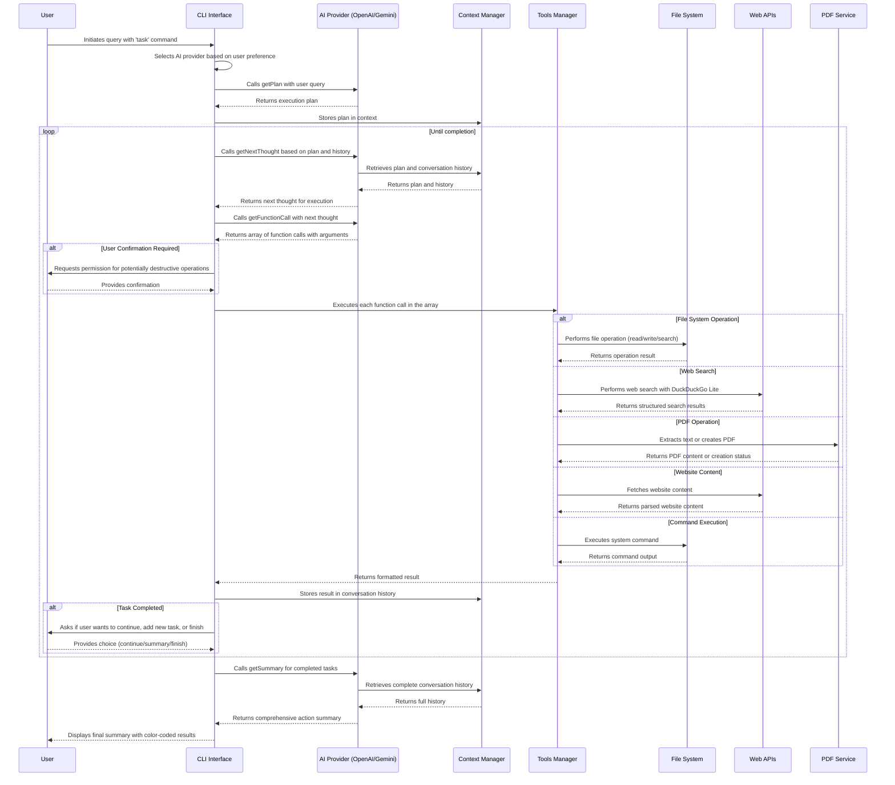

# AI Agent: AI-Powered Terminal Assistant for Any Task

## Project Timeline

- Started: March 2, 2025
- Status: Ongoing
- Last Updated: March 18, 2025


## Overview

The AI Agent is an AI-powered CLI tool that uses OpenAI's GPT or Gemini models to assist with any task you need to perform on your computer. While initially designed for code analysis, it now serves as a general-purpose terminal assistant that can analyze codebases, search for specific patterns, perform operations on files, extract content from PDFs, search the web, and more. 

The system follows an agent-based architecture where the AI creates a plan, executes a series of tools according to that plan, and then summarizes the findings with detailed action summaries for each executed step. The updated architecture now supports parallel function calls, allowing the AI to request multiple tools to be executed simultaneously through an array-based function call implementation. This enhancement improves efficiency by enabling the execution of related operations in a single interaction rather than requiring multiple sequential calls.

## Features

- **Natural Language Understanding**: Ask questions about anything on your computer in plain English
- **Intelligent Task Assistance**: Get help with any task using your computer's resources
- **Intelligent Codebase Analysis**: Get insights about your code structure, patterns, and organization
- **Multiple AI Providers**: Choose between OpenAI and Google's Gemini models
  - OpenAI: Leveraging GPT-4o-mini for powerful code analysis capabilities
  - Gemini: Using Google's Gemini 2.0 Flash for efficient function calling and analysis
- **Centralized System Prompts**: Consistent prompting architecture across AI providers
  - Modular system prompt design for better maintainability
  - Provider-agnostic implementations for easier extension
- **Parallel Function Calls**: Support for executing multiple tools simultaneously
  - Array-based function call architecture for both OpenAI and Gemini providers
  - Improved efficiency through parallel tool execution
- **Web Research Integration**: Search the web directly from your terminal with DuckDuckGo Lite
  - Customizable search parameters including number of results
  - Structured results with titles, URLs, and descriptions
- **Comprehensive PDF Document Processing**: Extract and analyze text content from PDF files
  - Specify page ranges to extract content from specific pages
  - Get metadata about PDFs including page count and document information
  - Search for specific content within PDF documents
  - Extract and summarize key information from PDF files
- **File Operations**: Find files, read content, and create new files - all through conversational commands
- **Pattern Search**: Use grep-like functionality through simple queries
- **Execution Planning**: Advanced AI planning capabilities to break down complex requests into manageable steps
- **Action Summaries**: Get concise summaries of each executed step for better understanding
- **Colored Output**: Color-coded information display for better readability
- **Extensible Architecture**: Easy to add new tools and AI providers to enhance functionality
- **Markdown-Formatted Results**: Clean and readable output for improved developer experience

## Installation

1. Clone this repository:
   ```bash
   git clone https://github.com/grinsteindavid/collaborative-ai
   cd collaborative-ai
   ```

2. Install dependencies:
   ```bash
   npm install
   ```

3. Create a `.env` file in the project root and add your AI provider API keys:
   ```
   OPENAI_API_KEY=your_openai_api_key_here
   GEMINI_API_KEY=your_gemini_api_key_here
   ```

4. Make the script executable:
   ```bash
   chmod +x src/index.js
   ```

5. Link the package:
   ```bash
   npm link
   ```

6. Check the installation:
   ```bash
   which assistantQ
   assistantQ --version
   ```

## Usage

```bash
# Basic usage - ask for help with any task
node src/index.js task -q "help me accomplish a task"

# Specify AI provider (default: openai)
assistantQ task --query "What files are in src folder?" --provider openai

# Use Google's Gemini model instead of OpenAI
assistantQ task --query "What files are in src folder?" --provider gemini

# Execute system commands
node src/index.js task --query "run ls -la and summarize the output"

# Read file contents
node src/index.js task --query "read this file package.json"

# Perform web searches and generate structured output
assistantQ task --query "do a web search for top 5 social medias and create a json with that info"

# Perform domain-specific web search
node src/index.js task --query "search for nodejs best practices on github.com"

# Find specific patterns in your code
node src/index.js task --query "find all files that import axios"

# Get insights about your codebase architecture
assistantQ task --query "explain the directory structure and key components"

# Create documentation based on your code
node src/index.js task --query "generate documentation for the tools directory"

# Update an existing file with new content
assistantQ task --query "update package.json to add axios dependency"

# Extract content from a PDF file
node src/index.js task --query "extract text from document.pdf"

# Extract specific pages from a PDF file
assistantQ task --query "read pages 5-10 from my-documentation.pdf"

# Search for specific content within a PDF file
assistantQ task --query "find mentions of 'API authentication' in documentation.pdf"

# Summarize the content of a PDF file
assistantQ task --query "summarize the key points from research-paper.pdf"
```

## Options
- `-q, --query <query>`: Question or instruction about your codebase (required)
- `-p, --provider <provider>`: AI provider to use (default: openai)
- `-h, --help`: Display help information
- `-V, --version`: Display version information


## System Components

### Core Components

1. **Entry Point (index.js)**
   - Initializes the CLI command structure
   - Orchestrates the overall execution flow
   - Manages the loop of function calls until completion

2. **System Prompts**
   - Centralized directory of provider-agnostic prompts
   - Modular design for better maintainability and consistency
   - Implements four key prompt types:
     - `plan.js`: Execution planning instructions
     - `next-thought.js`: Next step determination guidelines
     - `function-call.js`: Tool selection instructions
     - `summary.js`: Results summarization parameters

3. **AI Providers**
   - **Provider Framework**
     - Provider-agnostic implementation through shared interface
     - Each provider must implement four key functions with identical signatures
     - Uses centralized system prompts for consistent behavior

   - **OpenAI Provider**
     - Handles communication with OpenAI APIs using GPT-4o-mini
     - Implements four key functions that use the centralized system prompts:
       - `getPlan`: Generates an execution plan
       - `getNextThought`: Determines the next step based on the plan
       - `getFunctionCall`: Selects the appropriate tool to execute
       - `getSummary`: Summarizes all findings after execution completes

   - **Gemini Provider**
     - Handles communication with Google's Generative AI APIs using Gemini 2.0 Flash
     - Uses optimized schema handling for function calling
     - Implements the same four key functions with Gemini-specific optimizations

4. **Context Management (context.js)**
   - Maintains state throughout execution
   - Stores conversation history, current directory, and plan
   - Provides utility functions for state management

5. **Tools Management (tools.js)**
   - Registers available tools with their schemas and execution functions
   - Validates tool arguments against schemas
   - Handles tool execution and formatting of results
   - Manages user confirmation for potentially destructive operations
   - Groups tools by functionality (file system, web, PDF, system)

### Available Tools

#### File System Operations
1. **list_directories**: Lists files and directories in a specified path
2. **read_file_content**: Reads the content of a file
3. **grep_search**: Searches for patterns in files
4. **find_files**: Finds files matching specific patterns
5. **create_file**: Creates a new file with specified content
6. **update_file**: Updates the content of an existing file

#### Web Interaction
7. **web_search**: Performs web searches using DuckDuckGo Lite with customizable max result count and domain filtering
8. **get_website_content**: Fetches and processes content from specified websites

#### PDF Operations
9. **read_pdf_file**: Extracts text content from PDF files with options for page selection
10. **create_pdf**: Creates PDF files from various input formats

#### System Interaction
11. **execute_command**: Executes system commands with user confirmation for safety
12. **show_info**: Displays color-coded information messages with appropriate icons

## Execution Flow Sequence



## Prompt Structure and Tool Sequence

### 1. Provider Selection and Plan Generation

The system starts with provider selection and plan generation:

1. **Provider Selection**:
   - Based on user-specified provider (default: OpenAI)
   - Supports both OpenAI (GPT-4o-mini) and Gemini (Gemini 2.0 Flash) models
   - Each provider implements the same core functions but with optimized implementations

2. **Plan Generation**:
   - The `getPlan` function uses a centralized prompt structure from `system-prompts/plan.js`
   - The prompt includes:
     - Operating system information
     - Node.js version
     - Current working directory
     - Available tools and their capabilities
   - User's query is included as the user message
   - Returns a structured plan with goal statement and numbered steps

### 2. Execution Loop

The system uses a three-stage process within an execution loop:

1. **Next Thought Generation**:
   - The `getNextThought` function generates the next action based on the plan
   - Uses centralized prompts from `system-prompts/next-thought.js`
   - Includes previous conversation history for context
   - Generates a detailed explanation of the next step to take

2. **Function Call Selection**:
   - The `getFunctionCall` function uses the next thought to select tools to execute
   - Uses centralized prompts from `system-prompts/function-call.js`
   - Selects appropriate tools and arguments based on the task
   - Returns an array of function call objects, each with name and arguments
   - Supports parallel tool calls for improved efficiency

3. **Tool Execution and User Interaction**:
   - Tools requiring confirmation prompt the user before execution
   - Tool execution is managed through the `executeTool` function
   - Function calls are processed sequentially from the array
   - Each tool has:
     - A JSON schema for argument validation
     - An execution function for the actual operation
     - A format function for result presentation
   - Results are color-coded using the logger utility
   - All results are stored in the conversation history
   - When tasks appear complete, user is asked whether to continue, add a new task, or finish

### 3. Array-Based Function Calls

The system has been enhanced with an array-based function call architecture that allows for parallel tool execution:

1. **Unified Return Format**:
   - Both OpenAI and Gemini providers now return function calls as arrays
   - Each array element is a structured object with `name` and `arguments` properties
   - Empty arrays indicate task completion or no tool selection

2. **Provider-Specific Implementations**:
   - **OpenAI Provider**:
     - Uses OpenAI's native `parallel_tool_calls` capability
     - Processes both modern tool calls format and legacy function call formats
     - Handles multiple function calls simultaneously when appropriate
   - **Gemini Provider**:
     - Converts Gemini's function call format to the standardized array format
     - Processes multiple function calls using dedicated array handling

3. **Sequential Execution Flow**:
   - While function calls are returned as an array, they are executed sequentially
   - The system iterates through the array of function calls and executes each one
   - Results from each execution are added to the conversation history

4. **Benefits**:
   - Improved efficiency by reducing round-trips between the system and AI providers
   - Enhanced contextual understanding by grouping related operations
   - More flexible agent behavior allowing for multi-step actions in a single response
   - Future-proof architecture supporting more advanced parallel execution patterns

### 4. Available Tools

The system provides a rich set of tools for various operations:

1. **File System Tools**:
   - Directory listing, file reading/creation/updating
   - Pattern-based file searching
   - Grep-like content searching

2. **Web Interaction Tools**:
   - Web search using DuckDuckGo Lite with customizable result count
   - Website content extraction and processing

3. **PDF Processing Tools**:
   - PDF content extraction with page selection
   - PDF creation from various input formats

4. **System Interaction**:
   - Command execution with safety confirmations
   - Information display with color-coding

### 4. Summary Generation

After completing the execution loop, the system generates a comprehensive summary:

- The `getSummary` function uses centralized prompts from `system-prompts/summary.js`
- Reviews the complete conversation history
- Compares actual execution against the original plan
- Generates a detailed summary of all actions and findings
- Results are presented with color-coding for better readability
- Adds the summary to the conversation history

## Special Focus: Key Features

### 1. Web Search Implementation

The web search tool (`web_search`) provides powerful web research capabilities:

- Uses DuckDuckGo Lite to avoid rate limiting issues
- Parses HTML responses with Cheerio to extract structured results
- Returns search results with titles, URLs, descriptions, and display URLs
- Can be customized with a maximum number of results parameter

### 2. Information Display

The show info tool (`show_info`) enhances the user experience:

- Uses chalk for colored console output
- Provides visual indicators with emoji prefixes based on message type
- Supports various message types: info, success, warning, error, and debug
- Makes complex information more digestible with formatted output

## System Design Principles

1. **Modular Architecture**: Each component has a single responsibility
2. **Stateful Context**: Maintains state throughout execution
3. **Tool Abstraction**: Tools are registered with a common interface
4. **Validation**: Arguments are validated against schemas
5. **Conversation Management**: All interactions are tracked as a conversation
6. **Provider Agnosticism**: Core system prompts are separate from provider implementations
7. **DRY Principle**: Centralized system prompts eliminate duplication across providers

## Conclusion

The AI Agent demonstrates an effective architecture for AI-powered CLI tools. By separating planning, execution, and summarization into distinct phases, it provides a structured approach to solving complex code analysis tasks. The use of tool abstractions allows for easy extension with new capabilities while maintaining a consistent interface for the AI to interact with.

## Example Output

```bash
assistantQ task --query "how many jpeg and pdf do i have in the old dir"
ℹ️  Generating plan...
ℹ️  I aim to determine the number of JPEG and PDF files in the "old" directory. First, I will explore the working directory to locate the "old" directory.

ℹ️  I will list the files in the current directory using the 'list_directories' tool.

ℹ️  I will find files in '/Users/looper/Desktop/old' directory for both JPEG and PDF patterns using the 'find_files' tool.

ℹ️  I will find files in '/Users/looper/Desktop/old' directory for PDF pattern using the 'find_files' tool.

ℹ️  Generating summary...

ℹ️  **Objective & Scope**: The objective was to determine the number of JPEG and PDF files in the "old" directory.

**Key Findings / Insights**:
- **JPEG Files**: 15 files found.
- **PDF Files**: 38 files found.

**Steps Taken / Process Overview**:
1. **Directory Exploration**: Initially, the working directory was explored to locate the "old" directory using the 'list_directories' tool, which confirmed its existence.
2. **File Discovery**: Subsequently, the 'find_files' tool was employed twice: first to locate JPEG files and then to locate PDF files within the identified "old" directory.

**Conclusion & Recommendations**:
- The directory contains a substantial number of image (JPEG) and document (PDF) files. It is advisable to organize these files if they are to be maintained, particularly concerning ease of access and retrieval.

**Supporting Data / References**:
- Metadata indicates a total of 15 JPEG and 38 PDF files found within the "old" directory.

This approach effectively combined directory exploration and file discovery to meet the project requirements comprehensively.
```

---------------------------------------------

```bash
assistantQ task --query "explain codebase"
ℹ️  Generating plan...
ℹ️  The goal is to explain the codebase by examining its structure and ideally understanding the main components and their functionalities. I will start by exploring the working directory to get an overview of the files and directories present. 

Let's proceed with that.

ℹ️  I will list the files in the current directory using the 'list_directories' tool.

ℹ️  I will examine the 'README.md' file in '/Users/looper/workshop/ai-agent-terminal/autonomous-assistantQ' to gain insights into the codebase and its main components using the 'read_file_content' tool.

ℹ️  I will explore the 'src' directory in '/Users/looper/workshop/ai-agent-terminal/autonomous-assistantQ' to gather more information about the codebase using the 'list_directories' tool.

ℹ️  I will check the 'providers' directory in '/Users/looper/workshop/ai-agent-terminal/collaborative-ai/src' to further analyze the codebase structure using the 'list_directories' tool.

ℹ️  I will explore the 'openai' directory in '/Users/looper/workshop/ai-agent-terminal/collaborative-ai/src/providers' to gather more information about the codebase using the 'list_directories' tool.

ℹ️  I will check the 'tools' directory in '/Users/looper/workshop/ai-agent-terminal/collaborative-ai/src' to gather more information about the codebase using the 'list_directories' tool.

ℹ️  I will check the 'utils' directory in '/Users/looper/workshop/ai-agent-terminal/collaborative-ai/src' to gather more information about the codebase using the 'list_directories' tool.

ℹ️  I have gathered the structure and key components of the codebase. I will now stop execution.

✅ Analysis of the AI Agent codebase has been completed. The directory structure and key components have been outlined.
ℹ️  Generating summary... 

ℹ️  ### Summary of Analysis on AI Agent Codebase

**Objective & Scope:**
The goal was to understand the structure and key components of the AI Agent, an AI-powered CLI tool designed to analyze codebases.

**Key Findings / Insights:**
- **Structure Overview:** The codebase primarily consists of several directories—`src`, `providers`, `tools`, and `utils`, with critical components for AI execution scattered throughout.
- **Core Components:**
  - **Entry Point:** `src/index.js` initializes the CLI.
  - **AI Provider:** The `src/providers/openai` directory manages communication with OpenAI APIs.
  - **Tool Management:** `src/tools` handles various file and operation management features.

**Steps Taken / Process Overview:**
1. Explored the top-level directory to identify its structure.
2. Delved into the `src` directory and its subdirectories: `providers`, `tools`, and `utils`, systematically reviewing their contents to understand functionality.

**Conclusion & Recommendations:**
The AI Agent exemplifies a robust architecture for AI-enhanced code analysis. It is modular and extensible, making it suited for integration with additional tools or AI capabilities. Future efforts should focus on expanding functionality
```
