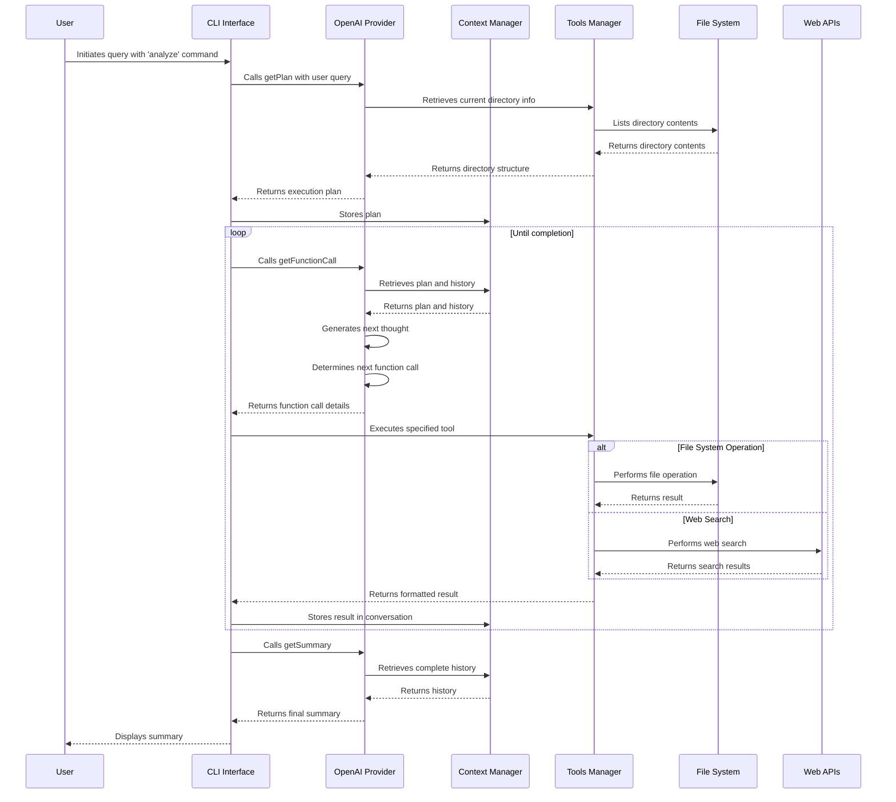

# Autonomous Code Analyzer: AI-Powered Codebase Intelligence

## Project Timeline

- Started: March 2, 2025
- Status: Ongoing


## Overview

The Autonomous Code Analyzer is an AI-powered CLI tool that uses OpenAI's GPT models to analyze codebases, search for specific patterns, and perform operations on files. The system follows an agent-based architecture where the AI creates a plan, executes a series of tools according to that plan, and then summarizes the findings.

## Features

- **Natural Language Understanding**: Ask questions about your codebase in plain English
- **Intelligent Codebase Analysis**: Get insights about your code structure, patterns, and organization
- **Web Research Integration**: Search the web directly from your terminal with DuckDuckGo Lite
  - Customizable search parameters including domain-specific queries
  - Structured results with titles, URLs, and descriptions
- **File Operations**: Find files, read content, and create new files - all through conversational commands
- **Pattern Search**: Use grep-like functionality through simple queries
- **Execution Planning**: Advanced AI planning capabilities to break down complex requests into manageable steps
- **Extensible Architecture**: Easy to add new tools and AI providers to enhance functionality
- **Markdown-Formatted Results**: Clean and readable output for improved developer experience

## Installation

1. Clone this repository:
   ```bash
   git clone https://github.com/yourusername/autonomous-code-analyzer.git
   cd autonomous-code-analyzer
   ```

2. Install dependencies:
   ```bash
   npm install
   ```

3. Create a `.env` file in the project root and add your OpenAI API key:
   ```
   OPENAI_API_KEY=your_openai_api_key_here
   ```

4. Make the script executable:
   ```bash
   chmod +x src/index.js
   ```

5. Link the package:
   ```bash
   npm link
   ```

6. Check the installation:
   ```bash
   which code-analyzer
   code-analyzer --version
   ```

## Usage

```bash
# Basic usage - ask a question about your codebase
node src/index.js analyze -q "explain codebase"

# Specify AI provider (default: openai)
code-analyzer analyze --query "What files are in src folder?" --provider openai

# Read file contents
node src/index.js analyze --query "read this file package.json"

# Perform web searches and generate structured output
code-analyzer analyze --query "do a web search for top 5 social medias and create a json with that info"

# Perform domain-specific web search
node src/index.js analyze --query "search for nodejs best practices on github.com"

# Find specific patterns in your code
node src/index.js analyze --query "find all files that import axios"

# Get insights about your codebase architecture
code-analyzer analyze --query "explain the directory structure and key components"

# Create documentation based on your code
node src/index.js analyze --query "generate documentation for the tools directory"

# Update an existing file with new content
code-analyzer analyze --query "update package.json to add axios dependency"
```

## Options
- `-q, --query <query>`: Question or instruction about your codebase (required)
- `-p, --provider <provider>`: AI provider to use (default: openai)
- `-h, --help`: Display help information
- `-V, --version`: Display version information


## System Components

### Core Components

1. **Entry Point (index.js)**
   - Initializes the CLI command structure
   - Orchestrates the overall execution flow
   - Manages the loop of function calls until completion

2. **AI Provider (OpenAI)**
   - Handles communication with OpenAI APIs
   - Implements three key functions:
     - `getPlan`: Generates an execution plan
     - `getFunctionCall`: Determines the next tool to execute
     - `getSummary`: Summarizes findings after execution

3. **Context Management (context.js)**
   - Maintains state throughout execution
   - Stores conversation history, current directory, and plan
   - Provides utility functions for state management

4. **Tools Management (tools.js)**
   - Registers available tools with their schemas and execution functions
   - Validates tool arguments against schemas
   - Handles tool execution and formatting of results

### Available Tools

1. **list_directories**: Lists files and directories in a specified path
2. **read_file_content**: Reads the content of a file
3. **grep_search**: Searches for patterns in files
4. **find_files**: Finds files matching specific patterns
5. **create_file**: Creates a new file with specified content
6. **update_file**: Updates the content of an existing file
7. **web_search**: Performs web searches using DuckDuckGo Lite

## Execution Flow Sequence



## Prompt Structure and Tool Sequence

### 1. Plan Generation

The system starts with the `getPlan` function, which uses the following prompt structure:

- **System Prompt**: Instructs the AI to create an execution plan based on:
  - Operating system info
  - Node.js version
  - Current working directory and its contents
  - Available tools and their descriptions
- **User Message**: Contains the user's query

The response is a structured plan with a goal statement and numbered steps.

### 2. Function Call Generation

The `getFunctionCall` function uses a two-stage process:

1. **First Stage (Next Thought)**:
   - System prompt contains context about directory, available tools, and instructions to follow the plan
   - Previous messages are included for context
   - Generates a "next thought" explaining what action will be taken

2. **Second Stage (Tool Selection)**:
   - Uses the next thought as guidance
   - Selects the appropriate tool and arguments
   - Returns a structured function call object

### 3. Tool Execution

Tools are executed based on their registered functions in the tools.js file:

1. Each tool has a schema for argument validation
2. The execution function is called with the provided arguments
3. Results are formatted according to each tool's formatting function
4. Results are added to the conversation history

### 4. Summary Generation

After all steps are completed, the `getSummary` function:

- Reviews the entire conversation history
- Compares actual execution against the original plan
- Generates a concise summary of findings
- Adds the summary to the conversation history

## Special Focus: Web Search Implementation

The web search tool (`web_search`) stands out as a particularly useful feature:

- Uses DuckDuckGo Lite to avoid rate limiting issues
- Parses HTML responses with Cheerio to extract structured results
- Returns search results with titles, URLs, descriptions, and display URLs
- Can be customized with a maximum number of results parameter

## System Design Principles

1. **Modular Architecture**: Each component has a single responsibility
2. **Stateful Context**: Maintains state throughout execution
3. **Tool Abstraction**: Tools are registered with a common interface
4. **Validation**: Arguments are validated against schemas
5. **Conversation Management**: All interactions are tracked as a conversation

## Conclusion

The Autonomous Code Analyzer demonstrates an effective architecture for AI-powered CLI tools. By separating planning, execution, and summarization into distinct phases, it provides a structured approach to solving complex code analysis tasks. The use of tool abstractions allows for easy extension with new capabilities while maintaining a consistent interface for the AI to interact with.

## Example Output

```bash
node src/index.js analyze -q "explain codebase"
Generating plan...

 Goal: The user wants a detailed explanation of the codebase located in the specified directory. I will start by reading the README.md file to gather an overview of the project and its structure, then analyze the contents of the src directory to understand the main components and functionalities implemented in the codebase. This will involve examining key files and functions to provide a comprehensive explanation. 


 ** I'll start by checking if the README.md file exists in the current directory to gather an overview of the project.

-- Tool: find_files
--Arguments: {"pattern":"README.md","dirPath":"/Users/looper/workshop/ai-agent-terminal/autonomous-code-analyzer","options":"","type":"f"}

-- Matches: 74

 ** I'll read the content of the README.md file to gather information about the project and its structure.

-- Tool: read_file_content
--Arguments: {"path":"/Users/looper/workshop/ai-agent-terminal/autonomous-code-analyzer/README.md"}


 ** I'll now analyze the contents of the `src` directory to further understand its structure and main components, specifically looking into the key files and their functionalities.

-- Tool: list_directories
--Arguments: {"path":"/Users/looper/workshop/ai-agent-terminal/autonomous-code-analyzer/src","options":"al"}

-- Matches: 4

 ** I'll read the `index.js` file first to understand its role as the main entry point of the codebase and how it orchestrates the CLI functionality.

-- Tool: read_file_content
--Arguments: {"path":"/Users/looper/workshop/ai-agent-terminal/autonomous-code-analyzer/src/index.js"}


 ** Next, I'll explore the contents of the `src/providers` directory to understand the available AI providers, particularly focusing on the implementation related to OpenAI.

-- Tool: list_directories
--Arguments: {"path":"/Users/looper/workshop/ai-agent-terminal/autonomous-code-analyzer/src/providers","options":"a"}

-- Matches: 2

 ** I'll read the `src/providers/index.js` file to understand how the AI providers, especially OpenAI, are structured and integrated into the project.

-- Tool: read_file_content
--Arguments: {"path":"/Users/looper/workshop/ai-agent-terminal/autonomous-code-analyzer/src/providers/index.js"}


 ** Next, I'll look into the `src/providers/openai` directory to analyze the specific implementation of the OpenAI provider and its functionalities.

-- Tool: list_directories
--Arguments: {"path":"/Users/looper/workshop/ai-agent-terminal/autonomous-code-analyzer/src/providers/openai","options":"a"}

-- Matches: 5

 ** I'll read the `src/providers/openai/getPlan.js` file to understand how the plan generation function works within the OpenAI provider context.

-- Tool: read_file_content
--Arguments: {"path":"/Users/looper/workshop/ai-agent-terminal/autonomous-code-analyzer/src/providers/openai/getPlan.js"}


 ** Next, I'll read the `src/providers/openai/getFunctionCall.js` file to understand how the function call generation is implemented within the OpenAI provider.

-- Tool: read_file_content
--Arguments: {"path":"/Users/looper/workshop/ai-agent-terminal/autonomous-code-analyzer/src/providers/openai/getFunctionCall.js"}


 ** I'll now read the `src/providers/openai/getNextThought.js` file to understand how the system generates the next thought based on the current context in the OpenAI provider.

-- Tool: read_file_content
--Arguments: {"path":"/Users/looper/workshop/ai-agent-terminal/autonomous-code-analyzer/src/providers/openai/getNextThought.js"}


 ** Next, I'll read the `src/providers/openai/getSummary.js` file to see how the summary generation is handled within the OpenAI provider.

-- Tool: read_file_content
--Arguments: {"path":"/Users/looper/workshop/ai-agent-terminal/autonomous-code-analyzer/src/providers/openai/getSummary.js"}


 ** Next, I'll explore the `src/tools` directory to analyze the available tools implemented in the project and their respective functionalities. I'll start by listing the files in this directory.

-- Tool: list_directories
--Arguments: {"path":"/Users/looper/workshop/ai-agent-terminal/autonomous-code-analyzer/src/tools","options":"a"}

-- Matches: 7

 ** I'll read the `src/tools/createFile.js` file to understand how the file creation functionality is implemented in the tools module.

-- Tool: read_file_content
--Arguments: {"path":"/Users/looper/workshop/ai-agent-terminal/autonomous-code-analyzer/src/tools/createFile.js"}


 ** I'll now read the `src/tools/findFiles.js` file to understand how the functionality for searching files is implemented within the tools module.

-- Tool: read_file_content
--Arguments: {"path":"/Users/looper/workshop/ai-agent-terminal/autonomous-code-analyzer/src/tools/findFiles.js"}


 ** Next, I'll read the `src/tools/listDirectories.js` file to understand how the functionality for listing directories is implemented in the tools module.

-- Tool: read_file_content
--Arguments: {"path":"/Users/looper/workshop/ai-agent-terminal/autonomous-code-analyzer/src/tools/listDirectories.js"}


 ** Next, I'll read the `src/tools/readFile.js` file to understand the implementation of the file reading functionality within the tools module.

-- Tool: read_file_content
--Arguments: {"path":"/Users/looper/workshop/ai-agent-terminal/autonomous-code-analyzer/src/tools/readFile.js"}


 ** I'll now read the `src/tools/searchGrep.js` file to understand how the text searching functionality is implemented within the tools module.

-- Tool: read_file_content
--Arguments: {"path":"/Users/looper/workshop/ai-agent-terminal/autonomous-code-analyzer/src/tools/searchGrep.js"}


 ** I'll now read the `src/tools/updateFile.js` file to understand how the functionality for updating files is implemented within the tools module.

-- Tool: read_file_content
--Arguments: {"path":"/Users/looper/workshop/ai-agent-terminal/autonomous-code-analyzer/src/tools/updateFile.js"}


 Generating summary... 

### Summary of Findings:

The Autonomous Code Analyzer is an AI-powered command-line interface (CLI) tool designed to analyze codebases. It leverages OpenAI's models to enhance interaction and provide insights into code structures. Here are the main components and functionalities:

1. **Main Components**:
   - **Entry Point (`src/index.js`)**: Initializes the CLI, orchestrates user commands, and manages the execution flow.
   - **AI Providers (`src/providers`)**: Currently includes the OpenAI provider, which communicates with OpenAI APIs for plan generation, function calls, and summarization.
   - **Toolset (`src/tools`)**: Contains various tools for file and directory operations (e.g., create, read, update, find).

2. **Key Functionalities**:
   - **Natural Language Queries**: Users can interact with the tool via natural language to inquire about the codebase, perform operations, and get insights.
   - **Execution Planning**: The tool generates a detailed plan based on user input using OpenAI's capabilities, executed in a structured manner.
   - **File Operations**: The tool can create, read, and update files, and perform complex file searches using regex-like pattern matching.
   - **Web Search Integration**: The tool allows users to search the web directly from the CLI, enhancing the ability to find specific information.

3. **Modular Architecture**:
   - Each component (CLI, AI provider, tools) follows a clear separation of responsibilities, making the system extensible and maintaining simplicity in implementation.

### Conclusion:
The Autonomous Code Analyzer showcases an advanced architecture for AI-powered CLI tools, combining natural language processing with structured programming capabilities to simplify code analysis tasks and enhance developer interaction with their codebases. The modular design allows for easy integration of new features or tools, ensuring versatility and adaptability in various development environments.
```