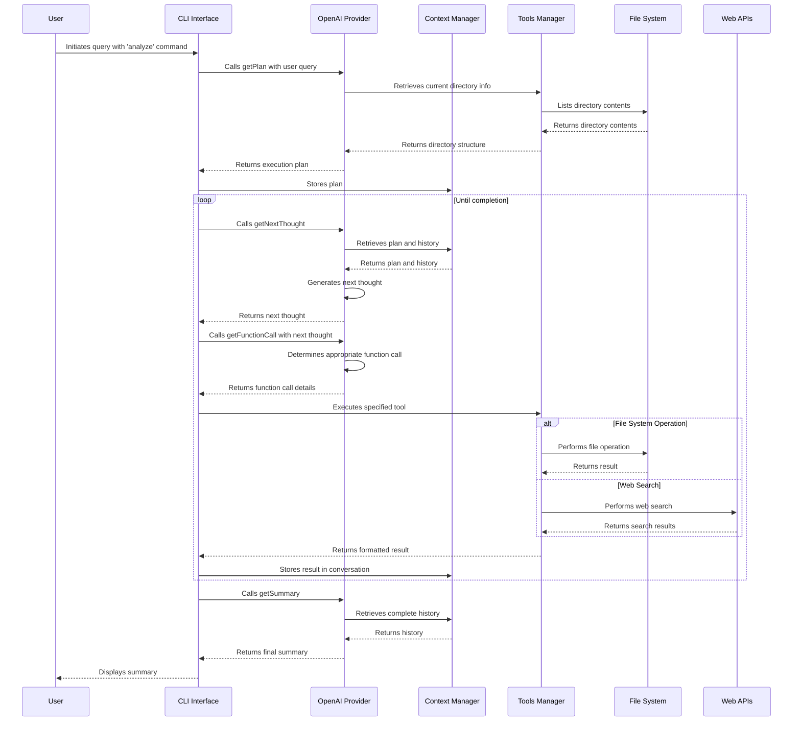

# Autonomous Code Analyzer: AI-Powered Codebase Intelligence

## Project Timeline

- Started: March 2, 2025
- Status: Ongoing


## Overview

The Autonomous Code Analyzer is an AI-powered CLI tool that uses OpenAI's GPT models to analyze codebases, search for specific patterns, and perform operations on files. The system follows an agent-based architecture where the AI creates a plan, executes a series of tools according to that plan, and then summarizes the findings with detailed action summaries for each executed step.

## Features

- **Natural Language Understanding**: Ask questions about your codebase in plain English
- **Intelligent Codebase Analysis**: Get insights about your code structure, patterns, and organization
- **Web Research Integration**: Search the web directly from your terminal with DuckDuckGo Lite
  - Customizable search parameters including number of results
  - Structured results with titles, URLs, and descriptions
- **File Operations**: Find files, read content, and create new files - all through conversational commands
- **Pattern Search**: Use grep-like functionality through simple queries
- **Execution Planning**: Advanced AI planning capabilities to break down complex requests into manageable steps
- **Action Summaries**: Get concise summaries of each executed step for better understanding
- **Colored Output**: Color-coded information display for better readability
- **Extensible Architecture**: Easy to add new tools and AI providers to enhance functionality
- **Markdown-Formatted Results**: Clean and readable output for improved developer experience

## Installation

1. Clone this repository:
   ```bash
   git clone https://github.com/grinsteindavid/ai-agent-code-analyzer.git
   cd autonomous-code-analyzer
   ```

2. Install dependencies:
   ```bash
   npm install
   ```

3. Create a `.env` file in the project root and add your OpenAI API key:
   ```
   OPENAI_API_KEY=your_openai_api_key_here
   ```

4. Make the script executable:
   ```bash
   chmod +x src/index.js
   ```

5. Link the package:
   ```bash
   npm link
   ```

6. Check the installation:
   ```bash
   which code-analyzer
   code-analyzer --version
   ```

## Usage

```bash
# Basic usage - ask a question about your codebase
node src/index.js analyze -q "explain codebase"

# Specify AI provider (default: openai)
code-analyzer analyze --query "What files are in src folder?" --provider openai

# Read file contents
node src/index.js analyze --query "read this file package.json"

# Perform web searches and generate structured output
code-analyzer analyze --query "do a web search for top 5 social medias and create a json with that info"

# Perform domain-specific web search
node src/index.js analyze --query "search for nodejs best practices on github.com"

# Find specific patterns in your code
node src/index.js analyze --query "find all files that import axios"

# Get insights about your codebase architecture
code-analyzer analyze --query "explain the directory structure and key components"

# Create documentation based on your code
node src/index.js analyze --query "generate documentation for the tools directory"

# Update an existing file with new content
code-analyzer analyze --query "update package.json to add axios dependency"
```

## Options
- `-q, --query <query>`: Question or instruction about your codebase (required)
- `-p, --provider <provider>`: AI provider to use (default: openai)
- `-h, --help`: Display help information
- `-V, --version`: Display version information


## System Components

### Core Components

1. **Entry Point (index.js)**
   - Initializes the CLI command structure
   - Orchestrates the overall execution flow
   - Manages the loop of function calls until completion

2. **AI Provider (OpenAI)**
   - Handles communication with OpenAI APIs
   - Implements four key functions:
     - `getPlan`: Generates an execution plan
     - `getNextThought`: Determines the next step based on the plan
     - `getFunctionCall`: Selects the appropriate tool to execute
     - `getSummary`: Summarizes all findings after execution completes

3. **Context Management (context.js)**
   - Maintains state throughout execution
   - Stores conversation history, current directory, and plan
   - Provides utility functions for state management

4. **Tools Management (tools.js)**
   - Registers available tools with their schemas and execution functions
   - Validates tool arguments against schemas
   - Handles tool execution and formatting of results

### Available Tools

1. **list_directories**: Lists files and directories in a specified path
2. **read_file_content**: Reads the content of a file
3. **grep_search**: Searches for patterns in files
4. **find_files**: Finds files matching specific patterns
5. **create_file**: Creates a new file with specified content
6. **update_file**: Updates the content of an existing file
7. **web_search**: Performs web searches using DuckDuckGo Lite with customizable max result count
8. **show_info**: Displays color-coded information messages with appropriate icons

## Execution Flow Sequence



## Prompt Structure and Tool Sequence

### 1. Plan Generation

The system starts with the `getPlan` function, which uses the following prompt structure:

- **System Prompt**: Instructs the AI to create an execution plan based on:
  - Operating system info
  - Node.js version
  - Current working directory and its contents
  - Available tools and their descriptions
- **User Message**: Contains the user's query

The response is a structured plan with a goal statement and numbered steps.

### 2. Function Call Generation

The system now uses a more structured three-stage process:

1. **First Stage (Next Thought Generation)**:
   - The `getNextThought` function generates the next step based on the plan
   - System prompt contains context about directory, available tools, and instructions to follow the plan
   - Previous messages are included for context
   - Generates a "next thought" explaining what action will be taken

2. **Second Stage (Tool Selection)**:
   - The `getFunctionCall` function uses the next thought as guidance
   - Selects the appropriate tool and arguments
   - Returns a structured function call object

### 3. Tool Execution

Tools are executed based on their registered functions in the tools.js file:

1. Each tool has a schema for argument validation
2. The execution function is called with the provided arguments
3. Results are formatted according to each tool's formatting function
4. Results are added to the conversation history

### 4. Summary Generation

After all steps are completed, the `getSummary` function:

- Reviews the entire conversation history
- Compares actual execution against the original plan
- Generates a concise summary of findings
- Adds the summary to the conversation history

## Special Focus: Key Features

### 1. Web Search Implementation

The web search tool (`web_search`) provides powerful web research capabilities:

- Uses DuckDuckGo Lite to avoid rate limiting issues
- Parses HTML responses with Cheerio to extract structured results
- Returns search results with titles, URLs, descriptions, and display URLs
- Can be customized with a maximum number of results parameter

### 2. Information Display

The show info tool (`show_info`) enhances the user experience:

- Uses chalk for colored console output
- Provides visual indicators with emoji prefixes based on message type
- Supports various message types: info, success, warning, error, and debug
- Makes complex information more digestible with formatted output

## System Design Principles

1. **Modular Architecture**: Each component has a single responsibility
2. **Stateful Context**: Maintains state throughout execution
3. **Tool Abstraction**: Tools are registered with a common interface
4. **Validation**: Arguments are validated against schemas
5. **Conversation Management**: All interactions are tracked as a conversation

## Conclusion

The Autonomous Code Analyzer demonstrates an effective architecture for AI-powered CLI tools. By separating planning, execution, and summarization into distinct phases, it provides a structured approach to solving complex code analysis tasks. The use of tool abstractions allows for easy extension with new capabilities while maintaining a consistent interface for the AI to interact with.

## Example Output

```bash
code-analyzer analyze --query "explain ENTIRE codebase"
ℹ️  Generating plan...
ℹ️  Goal: The user wants me to explain the entire codebase. First, I need to explore the working directory to understand its structure and gather relevant information about the files within it.

ℹ️  I will list the files and directories in the current directory using the 'list_directories' tool.

🔍  Tool: list_directories
🔍  Arguments: {"path":"/Users/looper/workshop/ai-agent-terminal/autonomous-code-analyzer","options":"al"}

🔍 -- Matches: 11
ℹ️  I will explore the 'src' directory to gather more information about the codebase using the 'list_directories' tool.

🔍  Tool: list_directories
🔍  Arguments: {"path":"/Users/looper/workshop/ai-agent-terminal/autonomous-code-analyzer/src","options":"a"}

🔍 -- Matches: 4
ℹ️  I will list the files and directories in the 'providers' directory to gather more information about the codebase using the 'list_directories' tool.

🔍  Tool: list_directories
🔍  Arguments: {"path":"/Users/looper/workshop/ai-agent-terminal/autonomous-code-analyzer/src/providers","options":"a"}

🔍 -- Matches: 2
ℹ️  I will list the files and directories in the 'openai' directory to gather more information about the codebase using the 'list_directories' tool.

🔍  Tool: list_directories
🔍  Arguments: {"path":"/Users/looper/workshop/ai-agent-terminal/autonomous-code-analyzer/src/providers/openai","options":"a"}

🔍 -- Matches: 6
ℹ️  I will list the files and directories in the 'tools' directory to gather more information about the codebase using the 'list_directories' tool.

🔍  Tool: list_directories
🔍  Arguments: {"path":"/Users/looper/workshop/ai-agent-terminal/autonomous-code-analyzer/src/tools","options":"a"}

🔍 -- Matches: 8
ℹ️  I will list the files and directories in the 'utils' directory to gather more information about the codebase using the 'list_directories' tool.

🔍  Tool: list_directories
🔍  Arguments: {"path":"/Users/looper/workshop/ai-agent-terminal/autonomous-code-analyzer/src/utils","options":"a"}

🔍 -- Matches: 4
ℹ️  I will list the files and directories in the 'index.js' file located in the 'src' directory to further understand the codebase using the 'read_file_content' tool.

🔍  Tool: read_file_content
🔍  Arguments: {"path":"/Users/looper/workshop/ai-agent-terminal/autonomous-code-analyzer/src/index.js","encoding":"utf-8"}

ℹ️  I will now analyze the 'README.md' file to gather more information about the codebase using the 'read_file_content' tool.

🔍  Tool: read_file_content
🔍  Arguments: {"path":"/Users/looper/workshop/ai-agent-terminal/autonomous-code-analyzer/README.md"}

ℹ️  Generating summary... 

ℹ️  ### Summary of Codebase Analysis

#### Overview
The **Autonomous Code Analyzer** is a sophisticated AI-driven command-line interface (CLI) tool designed to analyze codebases utilizing OpenAI's technology. This project enables users to engage with their code in natural language, receiving insights into structure, patterns, and functionality, while also providing various file operations and web search capabilities.

#### Directory Structure and Key Components
1. **Project Structure**:
   - The primary entry point is `src/index.js`, responsible for initializing the CLI commands and managing the interaction flow.
   - `src/providers` houses the implementations for AI providers, specifically OpenAI, which facilitates planning, function calls, and result summarization.
   - `src/tools` includes various utility functions for managing files and directories (creation, reading, updating) and performing searches.

2. **Core Functionality**:
   - The CLI allows natural language queries about the codebase. It generates structured execution plans, which guide the AI through necessary actions.
   - Features rich functionality, including generating summaries of actions taken, web searches using DuckDuckGo Lite, and pattern matching, all while producing well-formatted output.

#### Command Functionality
- The command `analyze` is pivotal to user interaction, enabling them to ask questions and request operations on their code. It requires a query (`-q`) and optionally allows specification of the AI provider (`-p`).
- Various tools are available which include:
  - **list_directories**: Lists files and directories.
  - **read_file_content**: Reads the content of specified files.
  - **web_search**: Executes web searches and retrieves information.

#### Execution Flow
The code follows a mapped execution flow:
1. **Plan Generation**: The system begins by formulating a plan based on user input and context.
2. **Function Execution**: Tools are executed based on the generated plan, with contextual information retained throughout the process.
3. **Summary Generation**: After completing tasks, the system collates and returns a final summary of actions taken.

### Conclusion
The Autonomous Code Analyzer exemplifies a thoughtful architecture suited for AI-enhanced code analysis and manipulation. Its modular design, maintainability, and user-friendly interface promise to enhance developer productivity. Furthermore, its extensible nature allows easy introduction of new tools and AI providers, broadening its applicability in diverse programming environments. The project stands as a testament to integrating AI with practical software development tools, paving the way for future innovations in the domain.
```


```bash
code-analyzer analyze --query "CODE REVIEW BASED ON THE FOLLOWING GIT DIFF: $(git diff)"
Generating plan...

 Goal: The user wants me to carry out a code review based on a provided Git diff. To accomplish this, I will need to read the relevant files and analyze the changes indicated in the diff. I will begin by identifying the files affected by the diff and reviewing their current content. 


 ** I'll use the 'grep_search' tool to look for the relevant files that the Git diff affects within the current directory.

-- Tool: grep_search
-- Arguments: {"SearchDirectory":"/Users/looper/workshop/ai-agent-terminal/autonomous-code-analyzer","Query":"diff","Includes":["**/*.js","**/*.ts","**/*.py","**/*.java"],"MatchPerLine":false,"CaseInsensitive":true}

-- Matches: 1

 ** I'll read the content of the file "/Users/looper/workshop/ai-agent-terminal/autonomous-code-analyzer/src/providers/openai/getFunctionCall.js" using the 'read_file_content' tool to analyze the changes indicated in the diff.

-- Tool: read_file_content
-- Arguments: {"path":"/Users/looper/workshop/ai-agent-terminal/autonomous-code-analyzer/src/providers/openai/getFunctionCall.js"}


 Generating summary... 

The file in question is `getFunctionCall.js`, which contains a function that interacts with the OpenAI API to retrieve function call responses based on user instructions and converses history. Specifically, it formats a system message that outlines important conditions to manage function calls, including when to stop execution, whether to attempt different approaches, and criteria for returning function calls.

The diff involves a section of the system message that emphasizes important conditions regarding function calls. The changes specify the protocol for handling previous failures and indicate that multiple steps should be tracked to ensure the goals of the execution plan are met.

### Summary of Findings:

1. **Context and Functionality**: The function `getFunctionCall` is designed to generate responses from the OpenAI API based on input options and user interactions, following specific rules laid out in the comments.

2. **Notable Changes**: Enhanced clarity in the conditions for executing function calls, especially how to handle failed previous calls and tracking the execution of plan goals.

3. **Overall Impact**: The changes improve reliability and effectiveness in interaction with the OpenAI API by ensuring responses align with structured execution goals, likely aimed at optimizing user-centric functionality.

This assessment aligns with the original plan's goal of conducting a thorough review of the file impacted by the Git diff, ensuring the code’s functionality adheres to best practices while considering user experience. The results demonstrate careful consideration in the design of the function, enhancing the clarity and robustness of interaction logistics with the OpenAI service.
```