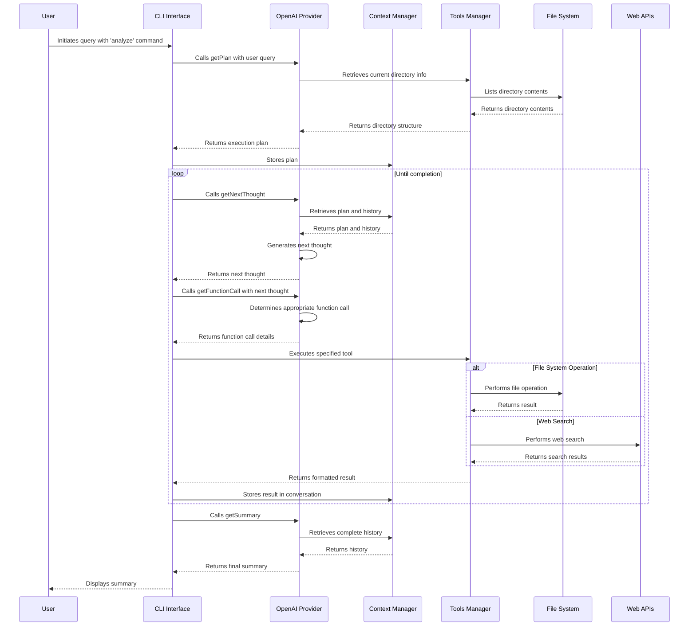

# AI Agent: AI-Powered Terminal Assistant for Any Task

## Project Timeline

- Started: March 2, 2025
- Status: Ongoing
- Last Updated: March 14, 2025


## Overview

The AI Agent is an AI-powered CLI tool that uses OpenAI's GPT models to assist with any task you need to perform on your computer. While initially designed for code analysis, it now serves as a general-purpose terminal assistant that can analyze codebases, search for specific patterns, perform operations on files, extract content from PDFs, search the web, and more. The system follows an agent-based architecture where the AI creates a plan, executes a series of tools according to that plan, and then summarizes the findings with detailed action summaries for each executed step.

## Features

- **Natural Language Understanding**: Ask questions about anything on your computer in plain English
- **Intelligent Task Assistance**: Get help with any task using your computer's resources
- **Intelligent Codebase Analysis**: Get insights about your code structure, patterns, and organization
- **Multiple AI Providers**: Choose between OpenAI and Google's Gemini models
  - OpenAI: Leveraging GPT-4o-mini for powerful code analysis capabilities
  - Gemini: Using Google's Gemini 2.0 Flash for efficient function calling and analysis
- **Centralized System Prompts**: Consistent prompting architecture across AI providers
  - Modular system prompt design for better maintainability
  - Provider-agnostic implementations for easier extension
- **Web Research Integration**: Search the web directly from your terminal with DuckDuckGo Lite
  - Customizable search parameters including number of results
  - Structured results with titles, URLs, and descriptions
- **Comprehensive PDF Document Processing**: Extract and analyze text content from PDF files
  - Specify page ranges to extract content from specific pages
  - Get metadata about PDFs including page count and document information
  - Search for specific content within PDF documents
  - Extract and summarize key information from PDF files
- **File Operations**: Find files, read content, and create new files - all through conversational commands
- **Pattern Search**: Use grep-like functionality through simple queries
- **Execution Planning**: Advanced AI planning capabilities to break down complex requests into manageable steps
- **Action Summaries**: Get concise summaries of each executed step for better understanding
- **Colored Output**: Color-coded information display for better readability
- **Extensible Architecture**: Easy to add new tools and AI providers to enhance functionality
- **Markdown-Formatted Results**: Clean and readable output for improved developer experience

## Installation

1. Clone this repository:
   ```bash
   git clone https://github.com/grinsteindavid/collaborative-ai
   cd collaborative-ai
   ```

2. Install dependencies:
   ```bash
   npm install
   ```

3. Create a `.env` file in the project root and add your AI provider API keys:
   ```
   OPENAI_API_KEY=your_openai_api_key_here
   GEMINI_API_KEY=your_gemini_api_key_here
   ```

4. Make the script executable:
   ```bash
   chmod +x src/index.js
   ```

5. Link the package:
   ```bash
   npm link
   ```

6. Check the installation:
   ```bash
   which assistantQ
   assistantQ --version
   ```

## Usage

```bash
# Basic usage - ask for help with any task
node src/index.js do -q "help me accomplish a task"

# Specify AI provider (default: openai)
assistantQ do --query"What files are in src folder?" --provider openai

# Use Google's Gemini model instead of OpenAI
assistantQ do --query"What files are in src folder?" --provider gemini

# Execute system commands
node src/index.js do --query"run ls -la and summarize the output"

# Read file contents
node src/index.js do --query"read this file package.json"

# Perform web searches and generate structured output
assistantQ do --query"do a web search for top 5 social medias and create a json with that info"

# Perform domain-specific web search
node src/index.js do --query"search for nodejs best practices on github.com"

# Find specific patterns in your code
node src/index.js do --query"find all files that import axios"

# Get insights about your codebase architecture
assistantQ do --query"explain the directory structure and key components"

# Create documentation based on your code
node src/index.js do --query"generate documentation for the tools directory"

# Update an existing file with new content
assistantQ do --query"update package.json to add axios dependency"

# Extract content from a PDF file
node src/index.js do --query"extract text from document.pdf"

# Extract specific pages from a PDF file
assistantQ do --query"read pages 5-10 from my-documentation.pdf"

# Search for specific content within a PDF file
assistantQ do --query"find mentions of 'API authentication' in documentation.pdf"

# Summarize the content of a PDF file
assistantQ do --query"summarize the key points from research-paper.pdf"
```

## Options
- `-q, --query <query>`: Question or instruction about your codebase (required)
- `-p, --provider <provider>`: AI provider to use (default: openai)
- `-h, --help`: Display help information
- `-V, --version`: Display version information


## System Components

### Core Components

1. **Entry Point (index.js)**
   - Initializes the CLI command structure
   - Orchestrates the overall execution flow
   - Manages the loop of function calls until completion

2. **System Prompts**
   - Centralized directory of provider-agnostic prompts
   - Modular design for better maintainability and consistency
   - Implements four key prompt types:
     - `plan.js`: Execution planning instructions
     - `next-thought.js`: Next step determination guidelines
     - `function-call.js`: Tool selection instructions
     - `summary.js`: Results summarization parameters

3. **AI Providers**
   - **OpenAI Provider**
     - Handles communication with OpenAI APIs using GPT-4o-mini
     - Implements four key functions that use the centralized system prompts:
       - `getPlan`: Generates an execution plan
       - `getNextThought`: Determines the next step based on the plan
       - `getFunctionCall`: Selects the appropriate tool to execute
       - `getSummary`: Summarizes all findings after execution completes

   - **Gemini Provider**
     - Handles communication with Google's Generative AI APIs using Gemini 2.0 Flash
     - Uses optimized schema handling for function calling
     - Implements the same four key functions with Gemini-specific optimizations

3. **Context Management (context.js)**
   - Maintains state throughout execution
   - Stores conversation history, current directory, and plan
   - Provides utility functions for state management

4. **Tools Management (tools.js)**
   - Registers available tools with their schemas and execution functions
   - Validates tool arguments against schemas
   - Handles tool execution and formatting of results

### Available Tools

1. **list_directories**: Lists files and directories in a specified path
2. **read_file_content**: Reads the content of a file
3. **grep_search**: Searches for patterns in files
4. **find_files**: Finds files matching specific patterns
5. **create_file**: Creates a new file with specified content
6. **update_file**: Updates the content of an existing file
7. **web_search**: Performs web searches using DuckDuckGo Lite with customizable max result count
8. **show_info**: Displays color-coded information messages with appropriate icons
9. **read_pdf_file**: Extracts text content from PDF files with options for page selection
10. **get_website_content**: Fetches and processes content from specified websites
11. **execute_command**: Executes system commands with user confirmation for safety

## Execution Flow Sequence



## Prompt Structure and Tool Sequence

### 1. Plan Generation

The system starts with the `getPlan` function, which uses the following prompt structure:

- **System Prompt**: Instructs the AI to create an execution plan based on:
  - Operating system info
  - Node.js version
  - Current working directory and its contents
  - Available tools and their descriptions
- **User Message**: Contains the user's query

The response is a structured plan with a goal statement and numbered steps.

### 2. Function Call Generation

The system now uses a more structured three-stage process:

1. **First Stage (Next Thought Generation)**:
   - The `getNextThought` function generates the next step based on the plan
   - System prompt contains context about directory, available tools, and instructions to follow the plan
   - Previous messages are included for context
   - Generates a "next thought" explaining what action will be taken

2. **Second Stage (Tool Selection)**:
   - The `getFunctionCall` function uses the next thought as guidance
   - Selects the appropriate tool and arguments
   - Returns a structured function call object

### 3. Tool Execution

Tools are executed based on their registered functions in the tools.js file:

1. Each tool has a schema for argument validation
2. The execution function is called with the provided arguments
3. Results are formatted according to each tool's formatting function
4. Results are added to the conversation history

### 4. Summary Generation

After all steps are completed, the `getSummary` function:

- Reviews the entire conversation history
- Compares actual execution against the original plan
- Generates a concise summary of findings
- Adds the summary to the conversation history

## Special Focus: Key Features

### 1. Web Search Implementation

The web search tool (`web_search`) provides powerful web research capabilities:

- Uses DuckDuckGo Lite to avoid rate limiting issues
- Parses HTML responses with Cheerio to extract structured results
- Returns search results with titles, URLs, descriptions, and display URLs
- Can be customized with a maximum number of results parameter

### 2. Information Display

The show info tool (`show_info`) enhances the user experience:

- Uses chalk for colored console output
- Provides visual indicators with emoji prefixes based on message type
- Supports various message types: info, success, warning, error, and debug
- Makes complex information more digestible with formatted output

## System Design Principles

1. **Modular Architecture**: Each component has a single responsibility
2. **Stateful Context**: Maintains state throughout execution
3. **Tool Abstraction**: Tools are registered with a common interface
4. **Validation**: Arguments are validated against schemas
5. **Conversation Management**: All interactions are tracked as a conversation
6. **Provider Agnosticism**: Core system prompts are separate from provider implementations
7. **DRY Principle**: Centralized system prompts eliminate duplication across providers

## Conclusion

The AI Agent demonstrates an effective architecture for AI-powered CLI tools. By separating planning, execution, and summarization into distinct phases, it provides a structured approach to solving complex code analysis tasks. The use of tool abstractions allows for easy extension with new capabilities while maintaining a consistent interface for the AI to interact with.

## Example Output

```bash
assistantQ do --query"how many jpeg and pdf do i have in the old dir"
ℹ️  Generating plan...
ℹ️  I aim to determine the number of JPEG and PDF files in the "old" directory. First, I will explore the working directory to locate the "old" directory.

ℹ️  I will list the files in the current directory using the 'list_directories' tool.

ℹ️  I will find files in '/Users/looper/Desktop/old' directory for both JPEG and PDF patterns using the 'find_files' tool.

ℹ️  I will find files in '/Users/looper/Desktop/old' directory for PDF pattern using the 'find_files' tool.

ℹ️  Generating summary...

ℹ️  **Objective & Scope**: The objective was to determine the number of JPEG and PDF files in the "old" directory.

**Key Findings / Insights**:
- **JPEG Files**: 15 files found.
- **PDF Files**: 38 files found.

**Steps Taken / Process Overview**:
1. **Directory Exploration**: Initially, the working directory was explored to locate the "old" directory using the 'list_directories' tool, which confirmed its existence.
2. **File Discovery**: Subsequently, the 'find_files' tool was employed twice: first to locate JPEG files and then to locate PDF files within the identified "old" directory.

**Conclusion & Recommendations**:
- The directory contains a substantial number of image (JPEG) and document (PDF) files. It is advisable to organize these files if they are to be maintained, particularly concerning ease of access and retrieval.

**Supporting Data / References**:
- Metadata indicates a total of 15 JPEG and 38 PDF files found within the "old" directory.

This approach effectively combined directory exploration and file discovery to meet the project requirements comprehensively.
```

---------------------------------------------

```bash
assistantQ do --query"explain codebase"
ℹ️  Generating plan...
ℹ️  The goal is to explain the codebase by examining its structure and ideally understanding the main components and their functionalities. I will start by exploring the working directory to get an overview of the files and directories present. 

Let's proceed with that.

ℹ️  I will list the files in the current directory using the 'list_directories' tool.

ℹ️  I will examine the 'README.md' file in '/Users/looper/workshop/ai-agent-terminal/autonomous-assistantQ' to gain insights into the codebase and its main components using the 'read_file_content' tool.

ℹ️  I will explore the 'src' directory in '/Users/looper/workshop/ai-agent-terminal/autonomous-assistantQ' to gather more information about the codebase using the 'list_directories' tool.

ℹ️  I will check the 'providers' directory in '/Users/looper/workshop/ai-agent-terminal/collaborative-ai/src' to further analyze the codebase structure using the 'list_directories' tool.

ℹ️  I will explore the 'openai' directory in '/Users/looper/workshop/ai-agent-terminal/collaborative-ai/src/providers' to gather more information about the codebase using the 'list_directories' tool.

ℹ️  I will check the 'tools' directory in '/Users/looper/workshop/ai-agent-terminal/collaborative-ai/src' to gather more information about the codebase using the 'list_directories' tool.

ℹ️  I will check the 'utils' directory in '/Users/looper/workshop/ai-agent-terminal/collaborative-ai/src' to gather more information about the codebase using the 'list_directories' tool.

ℹ️  I have gathered the structure and key components of the codebase. I will now stop execution.

✅ Analysis of the AI Agent codebase has been completed. The directory structure and key components have been outlined.
ℹ️  Generating summary... 

ℹ️  ### Summary of Analysis on AI Agent Codebase

**Objective & Scope:**
The goal was to understand the structure and key components of the AI Agent, an AI-powered CLI tool designed to analyze codebases.

**Key Findings / Insights:**
- **Structure Overview:** The codebase primarily consists of several directories—`src`, `providers`, `tools`, and `utils`, with critical components for AI execution scattered throughout.
- **Core Components:**
  - **Entry Point:** `src/index.js` initializes the CLI.
  - **AI Provider:** The `src/providers/openai` directory manages communication with OpenAI APIs.
  - **Tool Management:** `src/tools` handles various file and operation management features.

**Steps Taken / Process Overview:**
1. Explored the top-level directory to identify its structure.
2. Delved into the `src` directory and its subdirectories: `providers`, `tools`, and `utils`, systematically reviewing their contents to understand functionality.

**Conclusion & Recommendations:**
The AI Agent exemplifies a robust architecture for AI-enhanced code analysis. It is modular and extensible, making it suited for integration with additional tools or AI capabilities. Future efforts should focus on expanding functionality
```
